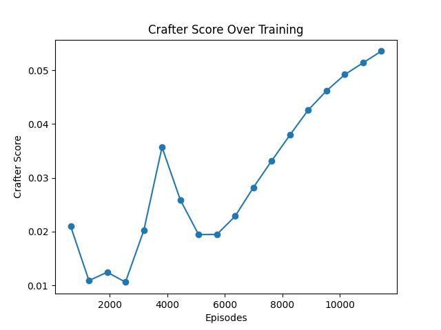
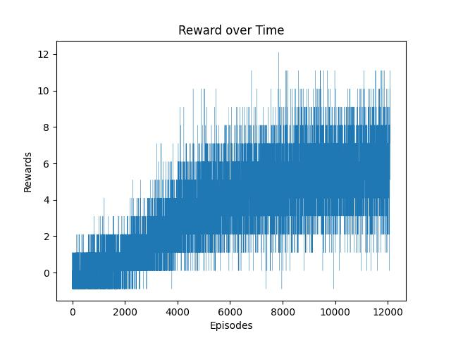
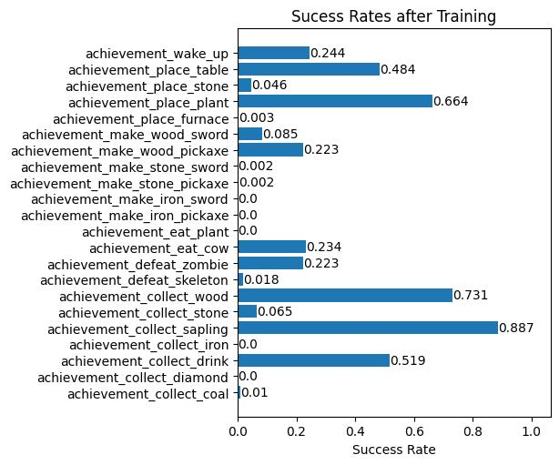

# Crafter

https://github.com/user-attachments/assets/1916b8b0-54d0-4d15-9286-0c5fb2905ef7

# Abstract:
Reinforcement Learning (RL) has shown great aptitude at learning on a diverse number
of control tasks, notably Atari video games.. However, these tasks are mainly determined by in
the moment choices without need for long term planning.
Crafter is a 2D open world survival game made by Danijar Hafner, a researcher at Deep
Mind. Successful performance in crafter requires an agent to makes its way through a long
term progression system. As such Crafter poses challenges to current models requiring
generalization, and long-term planning.

### Problem: The goal of this project is to train an RL agent to successfully play Crafter.
# Description of the environment:
Crafter features randomly generated 2D worlds where the player needs to forage for
food and water, find shelter to sleep, defend against monsters, collect materials, and build
tools. Crafter divides these goals into achievements and rewards agents based on which
achievements are achieved in an episode (harder achievements yield more reward).
Furthermore these achievements are dependent wherein some cannot be completed
without completion of earlier achievements. For example to get stone, an agent must first - get
wood, create a crafting table, and finally create a pickaxe
Observations returned from the Crafter environment are 64x64 color pixel images, and
agents can choose from 1 of 16 different actions each step

### List of Actions: 
‘move up’, ‘move down’,’ move left’, ‘move right’, ‘interact’ (gather material,
drink, hit), ‘sleep’, ‘place crafting table’, ’place rock’, ‘place furnace’, ‘place plant’, ‘craft wood
pickaxe’, ‘craft stone pickaxe’, ‘craft iron pickaxe’, ‘craft wood sword’, ‘craft stone sword’,
‘craft iron sword’

### List of Achievements: 
'collect_coal', 'collect_diamond', 'collect_drink', 'collect_iron',
'collect_sapling', 'collect_stone', 'collect_wood', 'defeat_skeleton', 'defeat_zombie', 'eat_cow',
'eat_plant', 'make_iron_pickaxe', 'make_iron_sword', 'make_stone_pickaxe',
'make_stone_sword', 'make_wood_pickaxe', 'make_wood_sword', 'place_furnace',
'place_plant', 'place_stone', 'place_table', 'wake_up'
# Technical Approach:

Our approach in constructing an agent was to pair a convolutional neural net with an
actor critic PPO model. The observation from the environment is passed into a series of 3
convolutional layers converting it into a one dimensional array of features. This is then fed into
a PPO network which outputs a distribution over the 16 categorical actions.
Our network was first trained using behavior cloning on a data set of expert human
performances for 20 epochs. It was then trained for 120 PPO training epochs each with a
rollout of 100 episodes with a max episode length of 1024 frames. The model then randomly
sampled the full rollout 5 times to perform gradient updates.

# Results:

The Rewards over training for our agent are shown above
As can be seen in the figure the variance of the rewards in an episode is extremely high.
To combat this high variance the Crafter Docs recommend evaluating agents based upon their
success rates over the different achievements over training.
A success rate is simply just the percentage of episodes where an agent completed an
achievement. The geometric mean of achievements actually achieved is dubbed the Crafter
Score. Crafter Scores over training are also shown above
Furthermore our agent exhibited emergent behavior such as sleeping during the night,
planting crops and harvesting food from them, crafting tools, and using blocks in combat to
protect themselves
Further Steps:
While our agent showed aptitude at a variety of achievements, it lacks contextual
awareness beyond the current screen. Implementing memory for the agent to allow better plan
and remember states would solve this issue. Finally vectorizing our environments to allow for
faster training on a number of GPU’s would allow our agent to progress and learn faster

# Figures:

